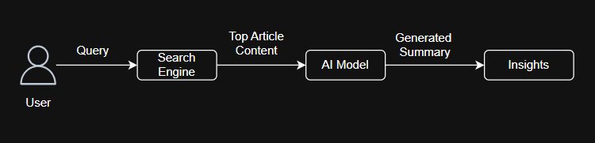

# Article Stats Finder

**This Python script is a tool for searching for articles on a specific topic, extracting their content, and then using the Google Gemini Pro model to find key statistics and insights. It's designed to help researchers, content creators, or anyone interested in quickly getting a quantitative overview of a subject.**

## Features

- **Google Search Integration**: Automatically searches Google for relevant articles based on a given query.  
- **Article Content Extraction**: Fetches and scrapes the main text content from the linked articles.  
- **AI-Powered Analysis**: Uses the Gemini Pro model to summarize and extract key statistics, percentages, and data points from the collected text.  
- **Real-time Insights**: Prints the URL and a summary of each article as it is processed.  

<p align="center">
  
</p>

## Prerequisites

Before running the script, you need to set up a few things:

1. **Python 3.x**: Ensure you have a recent version of Python installed.  
2. **Required Libraries**: Install the necessary Python packages using pip. You can find these in the `requirements.txt` file:  

   ```bash
   pip install -r requirements.txt
   ```

3. **API Keys**: This script relies on two external APIs. You must obtain API keys for both:
   - **Google Custom Search JSON API**: Used for fetching search results. You can get an API key and a Search Engine ID from the [Google Cloud Console](https://console.cloud.google.com/apis/credentials).  
   - **Google Gemini API**: Used for generating summaries. You need to enable the Gemini API in your Google Cloud project and get an API key from the [Google AI Studio](https://ai.google.dev/).  

## Setup

Create a `.env` file in the same directory as the script to store your API keys securely:

```env
API=your_gemini_api_key
API_SEARCH=your_google_custom_search_api_key
SEARCH_ENGINE_ID=your_search_engine_id
```

Replace the placeholder values (`your_...`) with your actual keys. **Do not commit this file to your version control (Git)!**

## How to Run

1. Make sure you have the prerequisites installed and the `.env` file configured.  
2. Open your terminal or command prompt.  
3. Run the Python script:  

   ```bash
   python your_script_name.py
   ```

   The script will print the fetched links, followed by the summarized statistics for each article it successfully scrapes.  

## How It Works

The script operates in a three-step process:

1. **Search**: It uses the `Google Search` function to query Google and retrieve a list of article URLs.  
2. **Scrape**: For each URL, the `fetch_article_content` function sends a request and uses `BeautifulSoup` to parse the HTML and extract the main text content, ignoring irrelevant parts of the page.  
3. **Summarize**: The extracted text is then passed to the `summarize_text_with_gemini` function. This function uses a carefully crafted prompt to instruct the Gemini model to focus specifically on identifying and listing statistics, numbers, and key insights from the article, providing a concise overview.  
